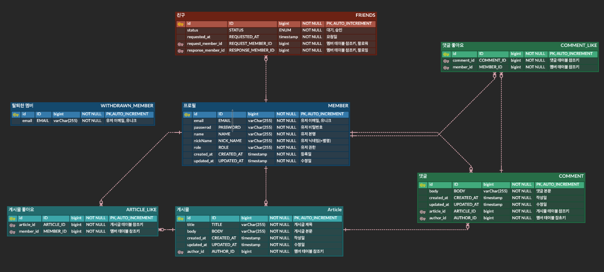

## 기능 요구 사항

### **1. 프로필 관리**

- **프로필 조회 기능**
    - 다른 사용자의 프로필 조회 시, 민감한 정보는 표시되지 않습니다.
        - 민감한 정보가 무엇일지는 팀 내에서 결정해주세요.
- **프로필 수정 기능**
    - 로그인한 사용자는 본인의 사용자 정보를 수정할 수 있습니다.
    - 비밀번호 수정 조건
        - 비밀번호 수정 시, 본인 확인을 위해 현재 비밀번호를 입력하여 올바른 경우에만 수정할 수 있습니다.
        - 현재 비밀번호와 동일한 비밀번호로는 변경할 수 없습니다.
    - **⚠️ 예외처리**
        - 비밀번호 수정 시, 본인 확인을 위해 입력한 현재 비밀번호가 일치하지 않은 경우
        - 비밀번호 형식이 올바르지 않은 경우
        - 현재 비밀번호와 동일한 비밀번호로 수정하는 경우

### **2. 뉴스피드 게시물 관리**

- **게시물 작성, 조회, 수정, 삭제 기능**
    - 조건
        - 게시물 수정, 삭제는 작성자 본인만 처리할 수 있습니다.
    - **⚠️ 예외처리**
        - 작성자가 아닌 다른 사용자가 게시물 수정, 삭제를 시도하는 경우
- **뉴스피드 조회 기능**
    - 기본 정렬은 생성일자 ****기준으로 내림차순 정렬합니다.
    - 10개씩 페이지네이션하여, 각 페이지 당 뉴스피드 데이터가 10개씩 나오게 합니다.

### **3. 사용자 인증**

- **회원가입 기능**
    - 사용자 아이디
        - 사용자 아이디는 이메일 형식이어야 합니다.
    - 비밀번호
        - `Bcrypt`로 인코딩합니다.
        - 대소문자 포함 영문 + 숫자 + 특수문자를 최소 1글자씩 포함합니다.
        - 비밀번호는 최소 8글자 이상이어야 합니다.
    - **⚠️ 예외처리**
        - 중복된 `사용자 아이디`로 가입하는 경우
        - `사용자 아이디` 이메일과 비밀번호 형식이 올바르지 않은 경우
- **회원탈퇴 기능**

  회원 탈퇴 방식을 어떻게 처리할지 고민해보세요.

    - 조건
        - 탈퇴 처리 시 `비밀번호`를 확인한 후 일치할 때 탈퇴 처리합니다.
        - 탈퇴한 사용자의 아이디는 재사용할 수 없고, 복구할 수 없습니다.
    - **⚠️ 예외처리**
        - `사용자 아이디`와 `비밀번호`가 일치하지 않는 경우
        - 이미 탈퇴한 `사용자 아이디`인 경우

### **4. 친구 관리**

- 특정 사용자를 친구로 추가/삭제 할 수 있습니다.
- 친구 기능이 구현되었다면, 뉴스피드에 친구의 최신 게시물들을 최신순으로 볼 수 있습니다.
    - **⚠️ 주의사항**
        - 친구는 상대방의 수락 기능이 필요합니다. 만약 어렵다면, 관심 유저를 팔로우하는 기능으로 개발하셔도 좋습니다.

### **5. 업그레이드 뉴스피드**

- 정렬 기능
    - 수정일자 기준 최신순
    - 좋아요 많은 순
- **기간별 검색 기능**
    - 예) 2024.05.01 ~ 2024.05.27 동안 작성된 뉴스피드 게시물 검색

### **6. 댓글**

- 댓글 작성, 조회, 수정, 삭제
    - 사용자는 게시물에 댓글을 작성할 수 있고, 본인의 댓글은 **수정 및 삭제**를 할 수 있습니다.
    - **내용**만 수정이 가능합니다.
    - 댓글 수정, 삭제는 댓글의 작성자 혹은 게시글의 작성자만 가능합니다.
- 댓글 수정, 삭제는 댓글의 작성자 혹은 게시글의 작성자만 가능합니다.

### **7. 좋아요**

- **게시물 및 댓글 좋아요 / 좋아요 취소 기능**
    - 사용자가 게시물이나 댓글에 좋아요를 남기거나 취소할 수 있습니다.
    - 본인이 작성한 게시물과 댓글에 좋아요를 남길 수 없습니다.
    - 같은 게시물에는 사용자당 한 번만 좋아요가 가능합니다.

## API 명세

[API 명세](https://www.notion.so/teamsparta/1232dc3ef51481069001fb1f84568f7b?v=1232dc3ef51481bba9ad000cf0d0b2f4&pvs=4)

## 담당 팀원

## ERD

